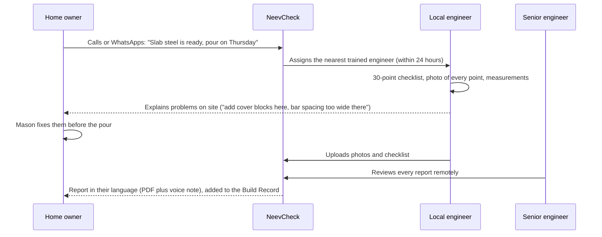

# NeevCheck: check it before concrete hides it

**One-line idea:** An on-demand, independent engineer check at the few **moments in house construction that can never be undone**, such as the steel inside the foundation, columns and roof slab just before the concrete is poured. It's built for the millions of families who build their own homes, and it's staffed by India's huge pool of civil-engineering graduates who can't find site jobs.

> *Neev* (नींव) means foundation. It's a working name, so check the trademark and domain first (§10).

---

## 1. The problem, told through one family

*Ravi is an illustrative composite, not a real person.*

Ravi, 38, is building a two-floor house in a Tier-2 town. It uses his life savings plus a bank loan, about ₹25 lakh. He isn't an engineer. His mason has 20 years' experience, and Ravi trusts him.

On slab day, the steel is tied, the concrete mixer arrives, and 30 workers pour the roof in six hours. Nobody checks:
- whether the bars are the diameter and spacing in the drawing,
- whether there are **cover blocks** under the steel (without them the steel rusts and the concrete cracks off in a few years),
- whether water was added to the concrete to make it easier to work, which weakens it,
- whether the lap lengths are right, the concrete was compacted, and the slab was cured for long enough.

**After that day nobody can ever check again.** The steel is buried inside the concrete.

Three monsoons later: cracks, a leaking terrace, rust stains. Repairs cost lakhs, the house is worth less, and in bad cases it's unsafe.

**This is common, not rare.**
- Much of India's housing, especially in small towns and villages, is built by families with a local mason or contractor and no builder or architect on site.
- Poor-quality material and cheating by contractors are a constant complaint ([Moneylife](https://www.moneylife.in/lrc/consumer-complaints/cheated-by-a-home-construction-company/4578.html), [HouseYog](https://www.houseyog.com/blog/top-15-house-construction-mistakes-in-india-and-how-to-avoid-them/)).
- **Government inspections don't cover this.** In Tamil Nadu, for example, the official plinth and last-storey inspections check that you follow the *approved plan* ([TN Single Window](https://tnswp.com/), [guide](https://1acre.in/guides/tamil-nadu/building-plan-approval-tamil-nadu)). They don't check whether the steel inside your slab is right.

**On the other side:** in a 2025 study, 83% of engineering graduates had no job or internship offer ([The Week](https://www.theweek.in/news/jobs-and-career/2025/03/22/more-than-80-per-cent-of-engineering-graduates-in-india-do-not-have-a-job-or-internship-offer-new-study-shows.html)). Civil engineering is among the hardest-hit branches, and Tamil Nadu has high engineering unemployment ([DT Next](https://www.dtnext.in/news/tamilnadu/tamil-nadu-lags-in-engineering-employability-despite-high-enrolment-minister-p-viswanathan)). Families need site checks, and graduates need site experience. Nobody connects the two.

---

## 2. Who already does what (honest landscape)

I can't prove no one has ever done this; small local consultants certainly exist. What I **couldn't find** is anyone doing it independently, on demand and affordably for families building their own homes, especially outside the metros.

| What exists | Examples | What it covers | What it misses |
|---|---|---|---|
| Full-service construction companies | [Brick&Bolt](https://www.bricknbolt.com/) (runs 470+ quality checks) | Quality checks **only on houses they build** | Families using their own mason or contractor, who are the majority in small towns |
| Home inspection for finished flats | [PropChk](https://propcheck.in/about-us/), [SnagEasy](https://www.snageasy.in/), [Nemmadi](https://nemmadi.in/about-us/), [HandOver Inspect](https://handoverinspect.com/) | Snag reports **after** construction, mostly metro apartments | The hidden steel. Once construction is finished, it can't be inspected |
| Site software for builders | [SiteSetu](https://sitesetu.app/) | Checklists for builders' own site teams | Independence. It's the builder checking itself |
| Local consultants | e.g. [construction auditing in Bengaluru](https://myhomemydesign.in/construction-auditing) | Ad-hoc audits | Not on demand, not affordable at the moment you need it, not available in small towns |
| Government | Plinth and last-storey inspections | Plan compliance | Structural quality |
| **Abroad** | In Australia, pre-slab-pour inspection is a standard paid service ([example](https://www.correctinspections.com.au/our-services/pre-slab-pour-inspection/)) | Shows the model works and people will pay | Not in India |

**The gap:** an independent engineer at the **irreversible moments**, bookable by a phone call, paid in cash or UPI, and priced for a family building in a town or village.

---

## 3. The idea: three insights

1. **Only about six moments truly matter.** You don't need an engineer on site every day. You need one at the moments that get buried:
   - the footing and foundation steel,
   - the plinth beam,
   - the column steel,
   - each roof slab before the pour,
   - the terrace waterproofing,
   - the concrete pour itself (water, compaction and curing).
   
   Checking those few moments gives most of the protection at a fraction of the cost of full supervision.
2. **The workforce already exists.** Every district has engineering colleges and unemployed civil graduates. With training, fixed checklists and a senior engineer reviewing every report, they can do the checks. They get paid real site experience, the thing employers say they lack.
3. **Every check leaves a permanent record.** The photos of the steel before the pour become the house's **Build Record**, a birth certificate showing what's inside its walls. That helps with resale (buyers of independent houses today have no idea what's inside), with loans, and with repairs years later.

---

## 4. How it works

### Products and prices (to be tested)
| Product | What | Price idea |
|---|---|---|
| **Video check** | The engineer guides the owner or mason over a WhatsApp video call with a checklist, for villages far from any engineer | ₹299–499 |
| **Site check** | The engineer visits at one critical moment | ₹999–1,999 |
| **Whole-house plan** | All 6–10 critical moments, from foundation to terrace | ₹9,999–14,999 (under 1% of a ₹25 lakh build) |
| **Leak and crack check** (monsoon season) | Diagnoses *why* an existing house leaks or cracks | ₹999 |

### Turning contractors into allies
Contractors who welcome checks earn a **"Checked Build" badge** and get customer leads. Good contractors *want* proof of their quality, because it wins them the next job. Only bad contractors fear the check, and that's the point.

---

## 5. Stress test: does it work in real life?

You rejected the last idea because it depended on something many workers don't have (UPI). So I checked this idea against the same kind of trap first.

| Question | Answer |
|---|---|
| **Does it depend on something customers may not have?** | **No.** Owners book by a plain phone call, pay in cash or UPI, and get a printed report plus a voice note in their language. Only the *engineers* need smartphones |
| "My mason has 20 years' experience. Why pay?" | It's not about distrust. On pour day, even good teams rush. ₹1,500 against a ₹25 lakh house is cheap insurance. Show real photos of common defects. Offer the first check at a discount |
| The contractor refuses entry | It's the owner's site and the owner's money. Position the engineer as "the family's engineer." Contractors who agree get the badge and leads |
| The pour date changes at the last minute | The check happens when the steel is tied, usually 1–2 days before the pour. Promise a visit within 24 hours, with the video check as a fallback |
| Villages far from engineers | Video checks. Recruit from the nearest district college |
| Fresh graduates lack experience | Two weeks of training on fixed checklists based on Indian Standard codes. Photos are compulsory, and a senior engineer reviews every report. New engineers start as assistants |
| Liability if something is missed | The report is an advisory quality check, not a structural design certificate. Clear terms, and professional indemnity insurance once you scale. Check local rules on who can sign what |
| Seasonality (little building in the monsoon) | Monsoon is when leaks show, so sell leak and crack diagnosis then. Construction season brings the pour checks |
| Big players copy it | Construction companies sell construction, so checking other people's builds conflicts with their core business. The moat is independence plus a local engineer network |

---

## 6. Business model

| Stream | Notes |
|---|---|
| Site and video checks, whole-house plans | Core revenue. The owner pays |
| "Checked Build" contractor listing | Subscription or per-lead fee from contractors who pass checks |
| Build Record for resale and loans (later) | Buyers, banks and valuers get a verified record of what's inside the walls, with the owner's consent |
| Bulk and institutional (later) | Banks funding construction loans, housing co-ops, NGO and government housing programmes where families build themselves |

**Keep independence sacred.** Never take money from cement or steel brands or from contractors in exchange for a pass. The moment a check can be bought, the product is dead.

**Illustrative unit economics for one site check at ₹1,499. These are assumptions to test.**

| | ₹ |
|---|---|
| Engineer payout | 700 |
| Travel | 150 |
| Senior review | 150 |
| Ops and payment | 100 |
| **Margin** | **~400** |

One engineer doing 2–3 checks a day earns ₹1,400–2,100 a day, which beats most first jobs available to them.

---

## 7. MVP: prove it before building it

**Get a co-founder or advisor first:** a senior civil engineer with 10+ years on residential sites. You bring the technology and marketing. They bring the checklists, training and credibility.

### Stage 0: concierge test (2–3 weeks, almost no code)
- **Your customers are visible from the street.** Every house under construction, with steel and bricks on the road, is a lead. Walk or ride through one town and talk to 20 owners.
- Do 10–15 checks yourself with one experienced engineer, and share the reports as WhatsApp PDFs.
- Talk to 10 civil graduates and 5 cement or steel dealers.

### Stage 1: build (3–4 weeks for a solo developer)
- **Booking:** a phone number plus a WhatsApp Business account, with a simple booking dashboard.
- **Engineer app:** a PWA with a stage-wise checklist. Each item needs a photo, measurements and a pass/fix mark. It works offline and uploads when the phone gets a signal.
- **Report:** an auto-generated PDF in the owner's language, plus a recorded voice summary.
- **Build Record:** a private web page per house with the photo timeline. The owner decides who sees it.

### Keep going or stop
| Signal | Keep going | Rethink |
|---|---|---|
| Owners who accept a check when offered on site | ≥ 30% | < 10% |
| Checks that find at least one fixable problem | ≥ 50% (this is your proof and your PR) | < 15%, meaning the value is too low |
| Owners who book the *next* stage | ≥ 50% | < 20% |
| Civil graduates willing to join at ₹700/check | Easy to recruit | Hard to recruit (rethink pay or model) |

---

## 8. Marketing plan

### 8.1 Positioning
> **For** families building their own home, **NeevCheck** sends an independent engineer at the moments that get buried in concrete, **so** mistakes get fixed while it's still cheap. **Unlike** construction companies, **we don't build, so we have no reason to hide anything.**

**Taglines**
- English: **"Check it before concrete hides it."**
- Tamil: **"கான்கிரீட் மூடுறதுக்கு முன்னாடி, ஒரு தடவை செக் பண்ணுங்க."**
- Hindi: **"कंक्रीट छुपा दे, उससे पहले जाँच लीजिए।"**

### 8.2 The unfair advantage: customers you can see
Most businesses have to *find* their customers. Yours are **standing on the street**: every site with steel rods, sand heaps and a concrete mixer. Street-level outreach is cheap, precise and hard for an online-only competitor to copy.

### 8.3 Channels, in priority order
1. **Site-to-site outreach.** Visit under-construction houses and leave a pamphlet with the owner or supervisor. Offer the first check at a discount.
2. **Cement, steel and hardware dealers.** Every family building a house visits them. Put a counter card with a QR code and number at the shop and give the dealer a small referral fee per booking. Dealers are for *distribution only* and never influence verdicts.
3. **YouTube and Instagram Reels in local languages.** House-construction videos are hugely popular in Indian languages. Run a series called **"What happens inside your slab"**, with real defects from your checks shown with the owner's consent. Every check produces content, and the content brings more checks.
4. **Plan-approval draughtsmen and local architects.** They meet every family *before* construction starts.
5. **Engineering colleges,** for recruiting engineers and for reach, since students' own families build houses. Offer internships to final-year civil students as assistant inspectors.
6. **Facebook and WhatsApp groups** where house builders ask questions.
7. **Bank branches** that give home-construction loans. Their borrowers are building right now.
8. **PR with your own data:** "We checked 100 roof slabs in [town]. X% had defects that would have been buried." That's a very newsworthy story.

### 8.4 Calendar (from 28 Sep 2026)
Construction slows in the monsoon and picks up after it. Use the rainy months, when leaks and cracks are visible, to build your audience.

| When | What |
|---|---|
| **Weeks 1–3** (28 Sep – 18 Oct) | Concierge test: 20 owner interviews, 10–15 checks, dealer and graduate conversations. Sign up a senior engineer |
| **Oct – Dec** | Build the booking system and engineer app. Train the first 5 engineers. Run a content series titled "Why your terrace leaks" (it's the rainy season in much of South India). Sell leak and crack checks |
| **Jan – May 2027** (main building season) | Paid launch in one town. 5 dealer partnerships. **Target 100 checks** |
| **After 100 checks** | Publish the "100 slabs" data story. Decide whether to expand to a second town or raise money |

### 8.5 Metrics
- **North star: irreversible moments checked**, meaning checks done before a pour.
- **Proof metrics:** the share of checks that find a fixable problem, and the problems fixed before concrete.
- **Growth:** repeat stages per house, referrals, and bookings per dealer.
- **Engineers:** active engineers, earnings per engineer, and how many later get hired thanks to this experience. That last one is great PR as well.

### 8.6 Bootstrapped 90-day budget (rough)
| Item | ₹ |
|---|---|
| Pamphlets and dealer counter cards | 5,000–10,000 |
| Discounted early checks (engineer payouts) | 15,000–25,000 |
| Engineer kits (tape, vernier caliper, gauges) | 3,000–5,000 |
| Content (phone mic, editing) | 3,000–5,000 |
| Travel and misc | 5,000–8,000 |
| **Total** | **~₹30,000–50,000** |

### 8.7 Ready-to-use copy
*Please have a native speaker proofread the Tamil and Hindi before printing.*

**A. Pamphlet for construction sites**
> **Building your house?**
> The roof slab is poured only once, and then no one can ever see the steel inside it again.
> Before the concrete goes in, **an engineer will check your steel**: bar size, spacing, cover blocks and laps.
> ₹___ · within 24 hours · report in your language
> 📞 / WhatsApp: ___
>
> **வீடு கட்டுறீங்களா?**
> ஸ்லாப் ஒரு தடவை தான் போடுவீங்க. உள்ள இருக்கிற கம்பியை அப்புறம் யாரும் பார்க்க முடியாது.
> கான்கிரீட் போடுறதுக்கு முன்னாடி, **ஒரு இன்ஜினியர் வந்து கம்பி கட்டை சரிபார்ப்பார்.**
> ₹___ · 24 மணி நேரத்துக்குள் · தமிழில் ரிப்போர்ட்
> 📞 / WhatsApp: ___
>
> **घर बना रहे हैं?**
> स्लैब एक ही बार डलता है, और उसके अंदर का सरिया फिर कभी नहीं दिखता।
> कंक्रीट डालने से पहले, **इंजीनियर आकर आपके सरिये की जाँच करेगा।**
> ₹___ · 24 घंटे के अंदर · आपकी भाषा में रिपोर्ट
> 📞 / WhatsApp: ___

**B. Dealer counter card**
> Buying steel for your slab? **Get it checked before the pour.** Scan the QR code or call ___. An independent engineer, not linked to any contractor or brand.

**C. WhatsApp forward**
> If you or someone you know is building a house right now, please forward this 🙏
> The steel inside your slab gets buried forever on pour day. For ₹___, an independent engineer checks it the day before. Most problems cost almost nothing to fix *before* the concrete goes in, and lakhs to fix after.
> Call or WhatsApp ___

**D. Reel scripts (30 seconds each)**
1. **"The few-rupee block that saves your slab."** Close-up of steel lying directly on the shuttering. *"No cover blocks. In 10 years this steel will rust, and the concrete will crack off."* Cut to cover blocks placed properly. *"A few rupees each. Check before you pour."*
2. **"Why your mason adds water."** Show wet, sloppy concrete being poured. *"Extra water makes concrete easier to pour and weaker for life."* End with the tagline.
3. **"What we found in 10 slabs."** A quick montage of real (consented) defects with a counter reading *"7 of 10 had a problem."* Use only your real numbers.

**E. Recruiting engineers**
> **Civil engineering graduates: earn while you get real site experience.**
> Inspect houses under construction in your own district. Get paid per check, trained on professional checklists and reviewed by senior engineers. Build a portfolio that site employers respect.
> Apply: ___

**F. Email to a college placement cell**
> **Subject:** Paid site-inspection internships for your final-year civil students
>
> Dear Sir/Madam,
> We run independent quality checks on houses under construction in [district]. We'd like to offer paid internships to your final-year civil students as assistant inspectors, working with senior engineers on real sites and following Indian Standard code checklists. Students get practical experience and a record of their inspections for their CVs.
> Could we have 20 minutes with your placement officer or HoD this month?
> [Name] · [phone]

**G. Press pitch (after 100 checks)**
> **Subject:** We checked 100 house roofs before the concrete was poured. Here's what we found.
>
> Most families in [town] build their own homes, with no engineer on site on pour day. Over [N] months, NeevCheck's engineers, most of them young local civil graduates, checked [100] slabs just before concreting. [X]% had at least one defect that would have been buried forever, most often [missing cover blocks / wrong spacing / extra water].
> Happy to share the anonymised data and connect you with families and engineers, with their consent.

---

## 9. Risks
| Risk | Response |
|---|---|
| Low willingness to pay | The concrete test answers this in 3 weeks. Try a discounted first check, dealer-sponsored discounts (without influence on verdicts), or the video check at a lower price |
| Quality of inspections | Fixed checklists, compulsory photos, senior review of 100% of reports at first and then sampling, and ratings |
| Legal and professional rules | Advisory report only. Confirm with a lawyer and your state's engineering or licensing rules before using words like "certified" |
| Conflict of interest | Never take money for passes. Make dealer and contractor relationships distribution-only, and publish that rule |
| A founder without a construction background | Bring in a senior civil engineer as co-founder or paid advisor on day one |

---

## 10. Before you print anything
- **Name:** "NeevCheck" is a placeholder, so check trademarks and domains. You may prefer a local-language name for your first town.
- **Numbers:** everything priced here is a guess to test in the concierge stage, not a forecast.

---

## Ideas I checked and dropped this round
| Idea | Why I dropped it |
|---|---|
| Saakshi (proof of work for domestic workers via UPI) | **Your objection is right:** many workers are paid in cash, so it would leave out the people who need it most |
| Borewell success prediction for farmers | Already exists: [JalDrishti](https://play.google.com/store/apps/details?id=com.jaldrishti.app) gives AI groundwater scores and shares drilling outcomes |
| Flood-risk lookup before buying or renting a home | Already exists for Tamil Nadu: [Verified.RealEstate Flood Inundation Finder](https://verified.realestate/dashboard/utility/flood-inundation-finder) |
| Apartment CPR and defibrillator responder network | Already exists: [WeRevive](https://www.werevive.in/) installs AEDs and trains volunteers in housing societies |

## Sources
- [Moneylife: cheated by a home construction company](https://www.moneylife.in/lrc/consumer-complaints/cheated-by-a-home-construction-company/4578.html) · [HouseYog: common house construction mistakes](https://www.houseyog.com/blog/top-15-house-construction-mistakes-in-india-and-how-to-avoid-them/)
- [TN Single Window Portal](https://tnswp.com/) · [TN building plan approval guide](https://1acre.in/guides/tamil-nadu/building-plan-approval-tamil-nadu)
- [The Week: 83% of engineering graduates without a job or internship offer (2025)](https://www.theweek.in/news/jobs-and-career/2025/03/22/more-than-80-per-cent-of-engineering-graduates-in-india-do-not-have-a-job-or-internship-offer-new-study-shows.html) · [DT Next: TN engineering employability](https://www.dtnext.in/news/tamilnadu/tamil-nadu-lags-in-engineering-employability-despite-high-enrolment-minister-p-viswanathan)
- [Brick&Bolt](https://www.bricknbolt.com/) · [SiteSetu](https://sitesetu.app/) · [PropChk](https://propcheck.in/about-us/) · [SnagEasy](https://www.snageasy.in/) · [Nemmadi](https://nemmadi.in/about-us/) · [HandOver Inspect](https://handoverinspect.com/) · [Construction auditing, Bengaluru](https://myhomemydesign.in/construction-auditing)
- [Pre-slab pour inspection in Australia](https://www.correctinspections.com.au/our-services/pre-slab-pour-inspection/)
- [JalDrishti](https://play.google.com/store/apps/details?id=com.jaldrishti.app) · [Verified.RealEstate flood finder](https://verified.realestate/dashboard/utility/flood-inundation-finder) · [WeRevive](https://www.werevive.in/)

*Research note: many pages were blocked from the environment this plan was written in, so some facts come from search-result summaries. Check the figures against the original pages before you quote them publicly.*
