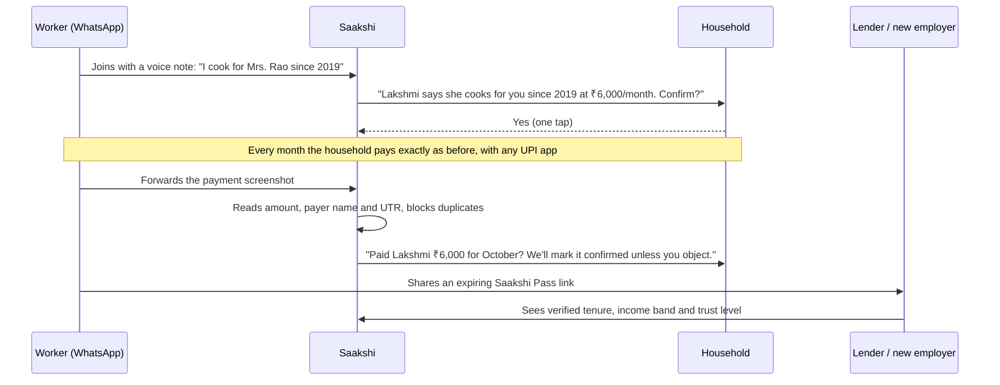

# Saakshi: every payment is a witness

**One-line idea:** Turn the salary UPI payments that India's domestic workers *already receive* into a verified work history that **the worker owns** and can show to a lender, a landlord, a new employer or a welfare board.

> *Saakshi* (साक्षी / சாட்சி / సాక్షి / ಸಾಕ್ಷಿ) means "witness" in almost every Indian language. The name is the product: every monthly payment becomes a witness to someone's work. It's a working name; see the naming note in §9.

---

## 1. The problem, told through one person

*Lakshmi is an illustrative composite, not a real person.*

Lakshmi, 41, has cooked for the same four families for eleven years. Three of them pay her by UPI every month. She earns about ₹22,000 a month, which is more than many salaried clerks.

- **She can't borrow fairly.** Her daughter's college fee is due. The bank asks for a salary slip, an ITR and a credit score, and she has none of them. The local moneylender charges several percent **per month**.
- **She can't move.** Her family is moving across the city. Eleven years of reputation live only in four families' heads. In the new area she's a stranger, and households are afraid to hire strangers.
- **She can't claim what she's owed.** State welfare boards for domestic workers ask for proof of employment. When an employer skips a month's pay, it's her word against theirs.

The household side is stuck too. Rahul needs a cook and is scared to let a stranger into his home. A police check only proves someone has *no criminal record*. It doesn't show that they're *reliable, skilled and have kept a job for eight years*.

**Scale:** as of March 2023, **2.79 crore** domestic and household workers had registered on the government's e-Shram portal, and **2.67 crore** of them were women ([PIB](https://www.pib.gov.in/PressReleasePage.aspx?PRID=1907685&reg=48&lang=2)). The true number is higher, because many never register.

---

## 2. Why this is still unsolved (the honest landscape)

I searched before recommending this. **I can't promise nobody has ever tried it, and someone did** (SERV'D, below). What matters is that nobody has *solved* it. Each existing player covers a slice:

| What exists | Examples | What it solves | What it misses |
|---|---|---|---|
| Household payslip / HR apps | [StaffAround](https://staffaround.com/blog/maid-salary-slip-format/), [MiVoice](https://domestic.mivoice.app/) | One employer's paperwork (attendance, payslips) | The worker doesn't own the record. It covers one employer at a time and nobody outside can verify it |
| Instant house-help apps | Pronto, Snabbit, Urban Company InstaHelp | Ratings, training, on-demand work | **Ratings stay inside the platform.** A worker who leaves loses their history |
| Background-check services | [Helpers Near Me](https://helpersnearme.com/blog/verification-of-domestic-help-is-easy-now-it-is-online/), police verification | "No criminal record" | Nothing about work quality, tenure or income |
| Job boards / agencies | [Kaamwalijobs](https://kaamwalijobs.com/) and many others | Matching | Profiles are self-reported. Agencies take a commission and are often distrusted |
| Government | e-Shram, state welfare boards | Registration | No work history. Welfare boards still ask for employment proof |
| **Earlier attempt** | **SERV'D** (2016–17; won a $100k grant from DFS Lab, a Gates-funded accelerator) | Digital agreements, payments and work history for domestic workers | **Now closed** ([Tracxn](https://tracxn.com/d/companies/servd/__Je2dlsfla4wgIQYcL5rVW2gA135eIjhJaJ_kQEkcDLw), [Forbes 2017](https://www.forbes.com/sites/chynes/2017/08/24/indias-domestic-work-industry-gets-servd-by-new-fintech-startup/)). It launched before UPI went mainstream. I couldn't find why it shut down |
| Student prototype | ["KaamPass" on GitHub](https://github.com/JSWATHI318/KaamPass) | A static demo of contractor-verified work records | A concept only, not a live product. It shows the idea is in the air |

**The gap I couldn't find anyone filling in 2026:** a record that is
1. **owned by the worker**,
2. **across all their employers**, both direct households and platforms,
3. **backed by real payments**, not just claims, and
4. **checkable by outsiders** (lenders, landlords, new employers, welfare boards).

### Why now, when SERV'D didn't work
- **UPI is already in everyone's pocket.** SERV'D had to get households to adopt a new way to pay. Saakshi **never touches the money** and only labels payments that already happen.
- **Work is becoming more mobile.** Urban Company's InstaHelp passed **100,000 orders in one day** in August 2026 ([StartupTalky](https://startuptalky.com/news/urban-company-instahelp-surpasses-100-000-daily-orders/), [Business Standard](https://www.business-standard.com/industry/news/100-000-daily-instant-househelp-orders-how-much-are-workers-earning-126080401144_1.html)). Pronto raised $25M in March 2026 ([TechCrunch](https://techcrunch.com/2026/03/02/indias-pronto-formalizes-house-help-as-its-valuation-jumps-8x-in-under-a-year/)). Workers now move between apps and households, and every move wipes out their history.
- **WhatsApp and voice AI in Indian languages** make it possible to serve workers who don't type, without asking them to install an app.
- **Lenders want new-to-credit borrowers.** Blue-collar lenders already underwrite with alternative data ([overview](https://wfintechs.substack.com/p/108-credit-in-the-gig-economy-how)).

---

## 3. The core insight

> **The proof already exists. It's just unlabeled.**

Every month, millions of households pay their help by UPI. Each payment is a timestamped, bank-verified fact, and the payer's name even shows on the worker's phone. What's missing is the *meaning*: who paid, for what work, and since when.

Label it once ("Mrs. Rao, cook, since 2019, ₹6,000/month"). From then on, **every salary payment adds another piece of evidence automatically.**

This is also what makes Saakshi valuable to lenders. **Account Aggregator shows a lender the money coming in. Saakshi tells them what that money means:** which credits are salary, from whom, and how stable they are.

**Design rule:** Saakshi never holds, moves or escrows money. That means no wallet licence, no payment licence and no new behaviour for households to learn.

---

## 4. How it works



### The trust ladder
The level of each work relationship is shown openly, so verifiers know how much to rely on it:

| Level | Meaning |
|---|---|
| **Claimed** | The worker says so |
| **Confirmed** | The household confirmed the relationship |
| **Witnessed** | Confirmed, and matched by a payment (same payer name, UTR not reused) |
| **Long-standing** | 6+ consecutive witnessed months |

### Friction killers
- **After 3 matching months, confirmation becomes "notify and object."** The household gets a message and doesn't have to act unless something is wrong. That keeps households involved without making them tap every month.
- **No app to install.** Everything runs on WhatsApp, voice notes work in the worker's language, and the Pass is a simple web link or QR code.
- **Workers without smartphones** can be onboarded at gate camps (§8), with a family member's phone as backup. Households can still confirm.

### What the worker controls
- Which employers appear on a shared Pass, since some workers won't want every household visible.
- Who sees income: the verifier gets an income *band* by default and exact figures only with explicit consent.
- How long a link lasts: every share expires and can be revoked.

### Fraud defences
- The payer name on the screenshot must match the confirmed household. UTRs are de-duplicated so one screenshot can't be reused.
- Relationship-graph checks: one "employer" vouching for 15 workers, or brand-new clusters vouching for each other, get flagged.
- Lenders see the trust level, and can cross-check the bank statement through Account Aggregator themselves as the regulated party.
- Random callback checks on a sample of households.

---

## 5. Business model

**Workers never pay. That's permanent and part of the brand.**

| Who pays | For what | How |
|---|---|---|
| **Lending partners** (NBFCs, MFIs, cooperative banks) | Pre-verified borrowers with labelled income | Sourcing fee per disbursed loan, paid by the lender and never the borrower, under a lending-service-provider arrangement |
| **Households hiring** | "Verified Hire": a candidate's full Pass plus a call with one past employer | ₹99–199 per check |
| **RWAs / apartment societies** | A verified staff registry for gate security | Annual subscription per society |
| **Insurance partners** | Distributing ₹20–50/month accident or health micro-policies | Commission through a licensed partner |
| **Platforms** (later) | Faster onboarding of workers with proven tenure, with the worker's consent | Per-candidate fee |

**Illustrative economics at 1 lakh workers.** These are assumptions to test, not forecasts:

| Stream | Assumption | ₹/year |
|---|---|---|
| Loans | 15% borrow once a year, ₹30,000 average, 1.5% fee | ~₹67 lakh |
| Verified Hire | 60,000 checks × ₹149 | ~₹89 lakh |
| RWA registry | 500 societies × ₹15,000 | ~₹75 lakh |
| Insurance | 20,000 policies × ₹100 commission | ~₹20 lakh |
| **Total** | | **~₹2.5 crore** |

1 lakh workers is under 0.4% of the domestic workers registered on e-Shram. The bigger prize is to become **the neutral verification layer** that platforms, lenders and insurers all use.

---

## 6. MVP: prove it before building it

### Stage 0: a concierge test (2 weeks, zero code)
- Pick **one** large apartment complex in the city you live in. You need to be physically at its gate.
- Keep records in a Google Sheet and send messages from your own WhatsApp. Collect screenshots by hand.
- Goal: 20 workers, 40+ households confirming, and one lender willing to look at the Passes.

### Stage 1: the WhatsApp MVP (about 3 weeks for a solo developer)
- **Messaging:** the WhatsApp Business Platform (Meta Cloud API, or a provider such as Gupshup, Interakt or AiSensy). Utility messages cost well under ₹1 each; check Meta's current India rates.
- **Backend:** Node/TypeScript or Python, with Postgres (e.g., Supabase).
- **Pass pages:** a small Next.js site, e.g., on Vercel, showing `saakshi.xyz/p/<code>`.
- **Screenshot reading:** OCR or a vision-capable AI model to pull out the amount, payer name, date and UTR.
- **Voice:** speech-to-text for Indian languages, so workers can talk instead of type.

```text
Worker(id, name, phone, language)
Household(id, name, phone, upi_name, pincode, society)
Relationship(id, worker_id, household_id, role, since, agreed_pay, level)
WorkMonth(relationship_id, month, amount, utr, screenshot_hash, confirmed_at, method)
Endorsement(relationship_id, tags[], note)
ShareLink(worker_id, scope, show_income, expires_at, revoked)
```

### Validation targets and kill criteria
| Signal | Keep going | Stop or rethink |
|---|---|---|
| Households confirm when *their own worker* asks | ≥ 60% | < 40% |
| Workers send month-2 screenshots without chasing | ≥ 50% | < 25% |
| Lender reaction to a sample Pass | "Send us 10 applicants" | "We wouldn't use this" (ask why, then pivot the Pass format) |
| Households who'd pay ₹149 to check a candidate | ≥ 20% say yes | < 5% |

---

## 7. Moat
1. **Neutrality.** Pronto, Snabbit and Urban Company employ or compete for these workers, so none of them can credibly offer a record the worker takes to a rival. A worker-owned, platform-neutral record is something they structurally can't build.
2. **The confirmed-relationship graph.** Years of witnessed household–worker relationships are hard to fake and slow to copy.
3. **Trust with workers**, earned through unions, NGOs and gate camps. That's a ground game, not a feature.

---

## 8. Marketing plan

### 8.1 Positioning
> **For** domestic workers who've worked honestly for years but have nothing to show for it, **Saakshi** turns the salary they already receive by UPI into a verified work record they own, **so they can** get fair loans, better jobs and their welfare benefits. **Unlike** platforms that keep your rating when you leave, **your Saakshi record goes wherever you go.**

**Taglines**
- English: **"Every payment is a witness."**
- Hindi: **"आपका काम ही आपकी पहचान।"** (Your work is your identity.)
- Tamil: **"உங்கள் உழைப்பே உங்கள் சாட்சி."** (Your labour itself is your witness.)
- For households: **"30 seconds of your time. Years of their work, finally on record."**

### 8.2 The cold-start trick: workers bring the households
Signing up households directly is expensive. **A household almost never refuses their own cook of several years** who asks, "Please tap confirm, it helps me get a loan." Many workers serve 3–5 homes, so each worker brings 3–5 households. Once those households are in, they see "Hiring help? Ask for their Saakshi Pass," and they tell their neighbours.

**The order:** workers (at the gate) → their employers (a WhatsApp tap) → the employers become verifiers and promoters inside their RWA groups.

### 8.3 Beachhead
Choose **one city and 2–3 large gated complexes** (500+ flats each). Why these:
- Density: one complex has hundreds of domestic workers.
- UPI is already the norm.
- Residents already talk in RWA WhatsApp groups.
- Everyone passes through one service gate, which makes it the natural place to reach workers.

### 8.4 Channels, in priority order
1. **"Saakshi Sunday" gate camps.** Set up a table at the service gate from 7–10 am and sign workers up in 3 minutes. Hand out a QR card, and give tea. Costs almost nothing.
2. **RWA partnerships.** Offer a free verified staff registry to pilot societies. The security committee becomes your champion.
3. **Worker referrals.** Give a ₹50 mobile recharge when a referred co-worker gets their first confirmed month. It's small but meaningful, and workers' word of mouth is strong.
4. **Domestic workers' unions and NGOs.** They already help members register with welfare boards, which ask for proof of employment ([TN scheme](https://www.tnlegalservices.tn.gov.in/welfare_schemes_GOs/12.%20No.II(2)%20LE%20515%20(d-4)%2020008.pdf), [TN board registration](https://tnuwwb.tn.gov.in/applications/register)). Offer Saakshi to them free, and confirm with the board whether it will accept the record as supporting proof.
5. **Festival moments.** Households think about their help at Diwali and Pongal/Sankranti bonus time. That's when to ask.
6. **Founder-led LinkedIn and Instagram posts** aimed at the professionals who employ domestic help. Build in public and share real numbers from your own interviews.
7. **PR.** Social impact plus UPI plus your own survey data makes a newsworthy story. Pitch YourStory, The Better India, Inc42 and regional-language newspapers.
8. **Lenders.** Start with one small NBFC, MFI or cooperative bank.
9. **Later: platforms.** Offer to supply workers with proven tenure.

### 8.5 90-day launch calendar (from 28 Sep 2026)
| When | What |
|---|---|
| **Weeks 1–2** (28 Sep – 11 Oct) | 20 worker interviews and 20 household interviews. Start the concierge MVP in 1 complex. First 3 lender conversations |
| **Weeks 3–5** (12 Oct – 1 Nov) | Build and ship the WhatsApp MVP. Expand to 2–3 complexes. Weekly gate camps |
| **Diwali week** (early Nov) | **"A bonus that lasts"** campaign to households (copy in 8.8) |
| **Nov – Dec** | First lender pilot of 5–10 loans. Start the first union/NGO partnership. Publish "What we learned from 300 domestic workers" with real data for PR |
| **Mid-Jan 2027** | Pongal/Sankranti campaign. Decide whether to raise money, apply for grants, or keep bootstrapping |

### 8.6 Metrics
- **North star: witnessed work-months.** Each one is a month of someone's work, proven.
- **Funnel:** workers joined → first household confirmed → 3 witnessed months → Pass shared → Pass *accepted* (loan, hire or welfare registration).
- **Impact, and your best PR material:** loans unlocked (₹), interest saved compared with the moneylender, and welfare registrations completed.
- **90-day targets (modest on purpose):** 300 workers, 900 households, 2,000 witnessed work-months, 1 lender pilot, 10 loans.

### 8.7 Bootstrapped 90-day budget (rough)
| Item | ₹ |
|---|---|
| WhatsApp messages and hosting (mostly free tiers) | 3,000–8,000 |
| QR cards, standees, posters | 5,000–8,000 |
| Referral recharges | 10,000–15,000 |
| Tea at gate camps, travel, misc | 5,000–10,000 |
| **Total** | **~₹25,000–40,000** |

### 8.8 Ready-to-use copy
*Please have a native speaker proofread the Hindi and Tamil before printing.*

**A. Message a worker sends to their employer (WhatsApp)**

> **EN:** Hello Madam/Sir, this is [Name]. I've registered on Saakshi to build proof of my work. Please tap "Confirm" once. It takes only 30 seconds and will help me get a bank loan. Thank you!
>
> **हिंदी:** नमस्ते मैडम/सर, मैं [नाम]। मैंने अपने काम का सबूत बनाने के लिए Saakshi पर रजिस्टर किया है। आप बस एक बार "Confirm" दबा दीजिए, सिर्फ़ 30 सेकंड लगेंगे। इससे मुझे बैंक से लोन मिलने में मदद मिलेगी। धन्यवाद!
>
> **தமிழ்:** வணக்கம் அம்மா/சார், நான் [பெயர்]. என் வேலைக்கு ஆதாரமாக Saakshi-ல பதிவு செய்திருக்கேன். நீங்க ஒரு தடவை "Confirm" அழுத்தினா போதும், 30 வினாடி தான். இதனால எனக்கு வங்கிக் கடன் கிடைக்க உதவும். நன்றி!

**B. Gate poster**

> **Worked honestly for years? Now you can prove it.**
> Free · 3 minutes · Sunday 7–10 AM at the service gate
>
> **सालों से ईमानदारी से काम कर रहे हैं? अब उसका सबूत पाइए।**
> मुफ़्त · सिर्फ़ 3 मिनट · रविवार सुबह 7–10 बजे, सर्विस गेट पर
>
> **பல வருஷமா நேர்மையா வேலை செய்றீங்களா? இப்போ அதுக்கு ஆதாரம்.**
> இலவசம் · 3 நிமிஷம் · ஞாயிறு காலை 7–10, சர்வீஸ் கேட் அருகில்

**C. RWA WhatsApp group announcement**

> Neighbours, a small ask with a big impact 🙏
> Many of our cooks, cleaners and drivers have worked in our homes for years, but they can't get a bank loan because they have no proof of income. Many end up borrowing from moneylenders at very high interest.
> **Saakshi** fixes this at no cost to anyone. When your help sends you a "Confirm" request on WhatsApp, just tap it. It takes 30 seconds. You don't pay anything or change how you pay them. You're simply confirming that they work for you.
> We're also running a free sign-up desk at the service gate this Sunday, 7–10 am. Please tell your help!

**D. Diwali campaign (to households)**

> **This Diwali, give a bonus that lasts.**
> Your bonus gets spent by January. Your 30-second confirmation on Saakshi becomes part of a verified work record they keep for life and can use for fair loans, better jobs and government benefits.
> *Every payment is a witness.*

**E. Founder LinkedIn post.** Fill in the bracketed numbers only with real data from your interviews:

> Last Sunday I stood at the service gate of my apartment complex and asked [20] cooks, cleaners and drivers one question:
> "If you needed ₹30,000 tomorrow, where would you get it?"
> [X] of them said a moneylender. The average time they'd worked for their current households: [Y] years.
> Most of them are paid by UPI every month. The proof of their income already exists. It's sitting in their phones, unlabeled.
> So I'm building **Saakshi**: a work record the worker owns, backed by the salary payments they already receive. Households confirm with one tap, and lenders get proof they can trust.
> If you employ domestic help and want to be in our first pilot, comment or DM me.

**F. Cold email to a lender (NBFC/MFI)**

> **Subject:** Pre-verified domestic-worker borrowers, with salary labelled by employer
>
> Hi [Name],
> Domestic workers often earn ₹15–30k a month steadily, but they're hard to underwrite because their bank statements show inflows with no employer identity or tenure.
> Saakshi fixes the missing label. Each worker's record shows which credits are salary, from which household, for how long, and whether the household confirmed it. It's built from UPI payments and confirmed by the employer.
> We're piloting in [city] with [N] workers and [M] households. Could we send you 10 consented profiles to evaluate against your own bank-statement checks? We only earn a fee, paid by you, on loans you choose to disburse.
> [Your name] · [phone]

**G. Press pitch**

> **Subject:** Story idea: the UPI payment that could replace a moneylender for India's house-help workers
>
> India has 2.79 crore registered domestic workers ([PIB](https://www.pib.gov.in/PressReleasePage.aspx?PRID=1907685&reg=48&lang=2)). Many are paid by UPI every month, yet banks still treat them as having no income proof.
> Saakshi, a [city] startup, turns those payments into a verified work record the worker owns. In our first [N] weeks: [workers], [households], [loans unlocked], and ₹[X] in moneylender interest avoided.
> I can connect you with workers and households from the pilot, with their consent.

**H. 30-second reel script**
> **0–5s:** Close-up of hands making rotis. Voice-over: "Eleven years. Four families. Not one document."
> **5–12s:** A bank counter. "Salary slip?" She shakes her head.
> **12–20s:** Her phone shows a UPI "₹6,000 received" notification. Text on screen: *The proof was always here.*
> **20–27s:** An employer taps "Confirm" on WhatsApp. Her Saakshi Pass fills up with ✓ Witnessed.
> **27–30s:** "Saakshi: every payment is a witness." Plus a QR code.

---

## 9. Risks and how to handle them
| Risk | Response |
|---|---|
| Households fear "formalising" (labour law, being reported) | Position Saakshi as the *worker's* record, not an employment contract. Share nothing with the government. Households choose exactly what they confirm |
| Worker privacy between employers | Scoped, expiring share links. Income shown as a band by default |
| Fake employers or collusion | Trust ladder, payer-name and UTR matching, graph checks, and lenders run their own Account Aggregator checks |
| Regulation | Follow the **DPDP Act 2023** and its rules (consent, purpose limits, deletion). For loans, work only through RBI-regulated lenders under their digital-lending rules. Never lend yourself and never charge borrowers. **Get a lawyer's review before the lender pilot** |
| A big player copies it | Neutrality is the moat (§7). Move fast on unions, NGOs and RWAs |
| Monthly confirmation fatigue | Switch to "notify and object" after 3 matched months |
| The name | "Sakshi" is also a large Telugu media brand, and "KaamPass" is taken by a GitHub prototype. **Search trademarks and domains before printing anything.** Alternatives: *KaamKhata*, *Bharosa Pass* |
| Repeating SERV'D's failure | Its reasons aren't public. Likely suspects are the need for a new payment method, no lender demand at launch, and the cost of acquiring households. Saakshi avoids all three: no new payment method, a lender from day one, and workers who bring their own households |

---

## 10. Ideas I considered and rejected
- **A scam circuit-breaker for elderly parents** that alerts family when a parent is on a long call with a stranger and then opens a banking app. Android and Truecaller are shipping parts of this, and the phone permissions it needs are tightly restricted.
- **Phone-call life-story recording for grandparents** in their own language. Emotional and marketable, but StoryWorth and HereAfter-style products already exist, so it's less of a real gap.
- **A tenant deposit passport.** Several rental platforms already work on deposits.

---

## Sources
- [PIB: 2.79 crore domestic and household workers on e-Shram (Mar 2023)](https://www.pib.gov.in/PressReleasePage.aspx?PRID=1907685&reg=48&lang=2)
- [TechCrunch: Pronto's $25M Series B (Mar 2026)](https://techcrunch.com/2026/03/02/indias-pronto-formalizes-house-help-as-its-valuation-jumps-8x-in-under-a-year/)
- [StartupTalky: InstaHelp passes 100,000 daily orders](https://startuptalky.com/news/urban-company-instahelp-surpasses-100-000-daily-orders/)
- [Business Standard: instant househelp orders and worker earnings](https://www.business-standard.com/industry/news/100-000-daily-instant-househelp-orders-how-much-are-workers-earning-126080401144_1.html)
- [Forbes India: the race to organise domestic work](https://www.forbesindia.com/article/news/deep-dive/what-help-on-demand-apps-can-do-better-to-retain-workers-amidst-price-wars/2994673/1)
- [Forbes (2017): SERV'D](https://www.forbes.com/sites/chynes/2017/08/24/indias-domestic-work-industry-gets-servd-by-new-fintech-startup/) · [Tracxn: SERV'D profile](https://tracxn.com/d/companies/servd/__Je2dlsfla4wgIQYcL5rVW2gA135eIjhJaJ_kQEkcDLw)
- [StaffAround: maid salary slip](https://staffaround.com/blog/maid-salary-slip-format/) · [MiVoice domestic HR](https://domestic.mivoice.app/)
- [KaamPass prototype on GitHub](https://github.com/JSWATHI318/KaamPass)
- [Helpers Near Me: domestic help verification](https://helpersnearme.com/blog/verification-of-domestic-help-is-easy-now-it-is-online/) · [Kaamwalijobs](https://kaamwalijobs.com/)
- [Tamil Nadu Domestic Workers Social Security and Welfare Scheme](https://www.tnlegalservices.tn.gov.in/welfare_schemes_GOs/12.%20No.II(2)%20LE%20515%20(d-4)%2020008.pdf) · [TN Unorganised Workers Welfare Board registration](https://tnuwwb.tn.gov.in/applications/register)
- [SIDBI: study on informal sector lending](https://www.sidbi.in/uploads/coca_reports/2019-03-29-165105-t9yg7-Study-on-Informal-Sector-Lending-Practices-in-India-Final-Report.pdf)
- [Credit in the gig economy (Kosh, Karmalife and others)](https://wfintechs.substack.com/p/108-credit-in-the-gig-economy-how)

*Research note: many of these pages were blocked from the environment this plan was written in, so some facts come from search-result summaries. Check the figures against the original pages before you quote them publicly.*
